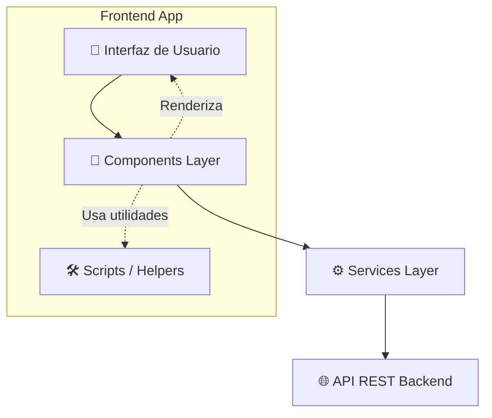

# 🚀 Project Proposals Dashboard


> Una aplicación frontend modular y ligera diseñada para la gestión, presentación y seguimiento de propuestas de proyectos técnicos y académicos.

---

## 📸 Preview

> 💡 *Espacio reservado para capturas de pantalla del dashboard, vistas de proyectos o un GIF de demostración.*

---

## 📖 Descripción

Este repositorio contiene la capa de presentación (Frontend) de un sistema de **Project Proposals**. La aplicación permite a los usuarios gestionar propuestas de desarrollo, revisar su estado actual y categorizarlas por área técnica. 

El mayor valor de este proyecto radica en su **arquitectura y calidad técnica**. En lugar de depender de frameworks pesados, el sistema está construido íntegramente con **Vanilla JavaScript**, demostrando un dominio sólido y profundo de los fundamentos web, manipulación eficiente del DOM y patrones de diseño de software aplicados en el frontend.

---

## ✨ Características Principales

* **Gestión de Propuestas:** Visualización detallada y presentación de nuevos proyectos (`PresentProject.js`).
* **Sistema de Usuarios:** Manejo de perfiles y sesiones (`User.js`, `Users.js`).
* **Categorización Dinámica:** Filtrado y visualización inteligente basada en estado y tipo de área (`Area.js`, `Status.js`, `Type.js`).
* **Feedback Reactivo:** Sistema de notificaciones e interacciones en tiempo real con el usuario (`Feedback.js`).
* **Renderizado de Badges:** Generación automática de etiquetas visuales para identificar el contexto de cada propuesta (`Badges.js`).

---

## 🛠️ Tecnologías Utilizadas

### Frontend
* **JavaScript (ES6+)**: Lógica core, modularidad y manipulación del DOM sin dependencias.
* **HTML5 Semántico**: Estructura base de la aplicación (`index.html`).
* **CSS3**: Estilos nativos (`styles.css`).

### Arquitectura & Patrones
* **Service/Repository Pattern**: Abstracción total de las llamadas HTTP hacia el backend.
* **Component-Based UI**: Separación lógica de la interfaz en módulos independientes.

---

## 🏗️ Arquitectura del Proyecto

El proyecto sigue una arquitectura por capas muy clara. Esta separación aísla las responsabilidades, lo que facilita el mantenimiento, el testing y prepararía el terreno para una eventual migración a un framework declarativo.



---

## 📂 Estructura del Proyecto

La organización de directorios refleja un enfoque escalable orientado a dominios:

```text
ProjectProposals_frontend-main/
├── index.html            # Entry point de la aplicación
├── css/
│   └── styles.css        # Hoja de estilos global
└── js/
    ├── main.js           # Orquestador principal e inicialización
    ├── Components/       # Capa de Interfaz y Lógica UI
    │   ├── Generic.js    # Componentes base reutilizables
    │   ├── PresentProject.js
    │   └── User.js
    ├── Scripts/          # Utilidades y Helpers UI
    │   ├── Badges.js     # Generación de etiquetas visuales
    │   └── Feedback.js   # Manejo de alertas, errores y modales
    └── Services/         # Capa de Dominio y Comunicación (API)
        ├── ProjectApi.js # Abstracción de endpoints de proyectos
        ├── Users.js      # Abstracción de endpoints de usuarios
        ├── Area.js       # Endpoints de áreas técnicas
        ├── Status.js     # Endpoints de control de estados
        └── informationApi.js # Configuración base HTTP y middleware
```

---

## 🧠 Decisiones Técnicas

* **Desacoplamiento de la API (Service Layer):** Se diseñó un directorio `Services/` dedicado exclusivamente a las peticiones HTTP. Esto evita acoplar la lógica de red con la manipulación de la vista, permitiendo cambiar la URL base, headers o la implementación fetch en un solo lugar (`informationApi.js`).
* **Modularidad Vanilla:** El uso de módulos separados para componentes UI (`js/Components/`) demuestra la aplicación de principios SOLID en JavaScript puro, evitando el "Spaghetti Code" común en proyectos sin frameworks.
* **Manejo Centralizado de Estado Visual:** La extracción de comportamientos visuales repetitivos a scripts como `Badges.js` y `Feedback.js` mantiene los componentes principales limpios y enfocados en su caso de uso principal.

---

## 🚀 Instalación y Configuración

1. **Clonar el repositorio:**
   ```bash
   git clone https://github.com/tu-usuario/ProjectProposals_frontend.git
   ```

2. **Ejecución local:**
   Al ser una arquitectura Vanilla SPA (Single Page Application), no requiere procesos de build. Puedes levantarlo usando cualquier servidor estático.
   * Usando la extensión *Live Server* en VSCode.
   * Usando un módulo de Python:
     ```bash
     python -m http.server 8000
     ```

3. **Conexión con Backend (Supuesto):**
   Asegúrate de configurar la URL de la API (Backend) en la capa de servicios, apuntando a tu servidor o entorno local.

---

## 🚀 Mejoras Futuras

* Implementación de un bundler (como Vite) para optimización, minificación de assets y ofuscación de código de cara a producción.
* Adición de tipado estático progresivo mediante JSDoc para mejorar la experiencia de desarrollo (DX).
* Integración de testing unitario para la lógica de negocio en la capa `Services`.

---

## 👨‍💻 Autor

**Maxi**  
*Fullstack Developer | Estudiante de Ingeniería en Informática*  
📍 Buenos Aires, Argentina  
🌎 Trilingüe (Español, Inglés, Portugués)

[](https://linkedin.com/in/tu-perfil-aqui)
[](https://github.com/tu-usuario)
