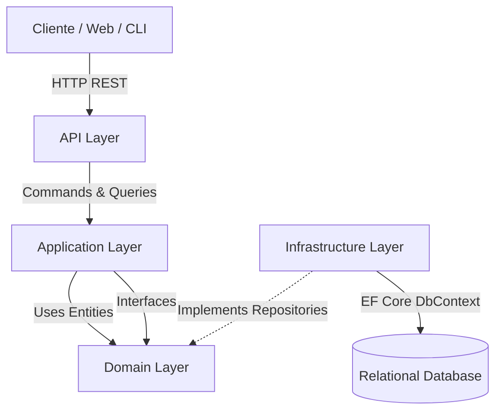

# 🚀 Project Proposals API

> Un motor backend avanzado para la gestión, evaluación y orquestación de flujos de aprobación de propuestas de proyectos institucionales.


---

# 📸 Preview

> 💡 **Espacio reservado para Demo:** Aquí puedes incluir un GIF o capturas mostrando las pruebas de los endpoints en Swagger UI o el flujo de una petición a través de un cliente REST como Postman/Insomnia.

---

# 📖 Descripción

**Project Proposals API** es una API REST desarrollada con **ASP.NET Core** para administrar el ciclo de vida de propuestas de proyectos mediante un flujo dinámico de aprobación.

El sistema determina automáticamente qué aprobadores intervienen en cada etapa según reglas de negocio, roles y el estado actual del proceso. La solución fue diseñada siguiendo principios de **Clean Architecture**, **CQRS** y **SOLID**, manteniendo una clara separación entre la lógica de negocio, la infraestructura y la capa de presentación.

---

# ✨ Características Principales

- ⚙️ Motor de flujos de aprobación basado en reglas de negocio.
- 📂 Gestión completa de propuestas de proyectos.
- 👥 Sistema de roles para aprobadores.
- 🗂️ Clasificación mediante Áreas y Tipos de Proyecto.
- 🛠️ Migraciones y Data Seeding con Entity Framework Core.
- ✅ Model Binding y validación automática mediante **ASP.NET Core Model Validation** y **Data Annotations**.
- 🧩 Arquitectura desacoplada utilizando Clean Architecture y CQRS.
---

# 🛠️ Tecnologías Utilizadas

## Backend & Core

- C#
- .NET
- ASP.NET Core Web API
- ASP.NET Core Model Binding & Validation
- Data Annotations

## Persistencia

- Entity Framework Core
- Fluent API
- SQL Server
- EF Core Migrations

## Arquitectura

- Clean Architecture
- CQRS
- Repository Pattern
- Dependency Injection
---

# 🏗️ Arquitectura del Proyecto

El sistema fue diseñado aplicando los principios de **Clean Architecture** fuertemente acoplados a **CQRS**, lo que garantiza que las reglas de negocio base sean completamente independientes de cualquier framework, interfaz o base de datos externa.



### Explicación de Capas:
- 🟣 **Domain:** El corazón del negocio. Contiene las entidades puras (`User`, `ProjectProposal`, `ProjectApprovalStep`, etc.) y las interfaces de los repositorios. Cero dependencias externas.
- 🔵 **Application:** Aloja la lógica de negocio estructurada en carpetas de **Commands** (`Add`, `Update`, `Delete`) y **Queries** (`GetAll`, `GetById`), además de DTOs y abstracciones de servicios.
- 🟢 **Infrastructure:** Capa de acceso externo. Implementa las interfaces del dominio, maneja la persistencia con `ProjectApprovalDbContext` e inyecta la lógica de las base de datos.
- 🟡 **Presentation:** Puntos de entrada del usuario o cliente, en este caso representados por la Web API (`ProjectApproval.Api`) y la herramienta de Consola (`ProjectApproval`).

---

# 📂 Estructura del Proyecto

```text
ProjectProposals_backend-main/
├── 📁 Application/                # Capa de aplicación (CQRS)
│   ├── 📁 <Entity>/Commands/      # Lógica de Mutación (Add, Delete, Update)
│   ├── 📁 <Entity>/Queries/       # Lógica de Lectura (GetAll, GetById)
│   ├── 📁 Dtos/                   # Data Transfer Objects
│   ├── 📁 Exceptions/             # Control y mapeo de excepciones
│   └── 📁 Interfaces/             # Contratos principales
├── 📁 Domain/                     # Capa central (Enterprise Business Rules)
│   ├── 📁 Entities/               # Modelos ricos del dominio
│   └── 📁 Interfaces/             # Contratos para repositorios
├── 📁 Infrastructure/             # Capa de Infraestructura
│   ├── 📁 Migrations/             # Historial de versiones EF Core
│   └── 📁 Persistence/            # DbContext, Repositorios y configuraciones
├── 📁 ProjectApproval.Api/        # Capa de Presentación REST
│   └── 📁 Controllers/            # Endpoints expuestos al exterior
└── 📁 ProjectApproval/            # CLI y utilidades
    ├── 📁 ConsoleInteractions/    # Menús e inputs
    └── 📁 FirstSetupBuild/        # Data Seeder (DataSeeder.cs)
```

---

# 🚀 Instalación y Configuración

Para poner en marcha la solución en un entorno de desarrollo, sigue los siguientes pasos:

1. **Clonar el repositorio:**
   ```bash
   git clone https://github.com/tu-usuario/ProjectProposals_backend.git
   cd ProjectProposals_backend-main
   ```

2. **Restaurar las dependencias de NuGet:**
   ```bash
   dotnet restore ProjectApproval.sln
   ```

3. **Configurar la base de datos:**
   Revisa tu cadena de conexión (ConnectionString) en el archivo `appsettings.json` ubicado dentro del proyecto `ProjectApproval.Api`.

4. **Aplicar las migraciones (Crear la DB y hacer el dataseed):**
   ```bash
   dotnet ef database update --project Infrastructure --startup-project ProjectApproval.Api
   ```

5. **Ejecutar la API:**
   ```bash
   dotnet run --project ProjectApproval.Api
   ```

---

# 🧠 Decisiones Técnicas y Valor Aportado

1. **Segregación de Responsabilidades con CQRS:**
   En lugar de usar grandes servicios con lógicas superpuestas, la capa de Aplicación está atomizada en `Commands` y `Queries` específicos por entidad. Esto prepara la aplicación para ser altamente escalable (pudiendo tener lecturas y escrituras manejadas con diferentes optimizaciones).
   
2. **Uso de Fluent API por encima de Data Annotations:**
   La configuración de las restricciones de la base de datos (longitud de strings, claves primarias/foráneas) se ha movido por completo a la carpeta `Configurations` dentro de la Infraestructura. Esto mantiene las Entidades del Dominio impecables, sin ensuciarse con atributos ligados a Entity Framework.

3. **Inyección de Dependencias y Principios SOLID:**
   El flujo de control depende 100% de abstracciones (interfaces de repositorios y manejadores). Esto facilita la capacidad de mockear servicios para realizar testeos eficientes en el futuro.

4. **Validación en la Capa de Aplicación mediante DTOs:**
   Todas las solicitudes HTTP son validadas utilizando **ASP.NET Core Model Validation** junto con **Data Annotations** (`Required`, `Range`, `StringLength`). De esta forma, únicamente solicitudes válidas llegan a la lógica de negocio, reduciendo código repetitivo en los controladores y manteniendo una separación clara entre validaciones de entrada y reglas del dominio.
---

# 🚀 Mejoras Futuras

- JWT Authentication
- Refresh Tokens
- Unit Testing
- Integration Testing
- Logging centralizado
- Docker
---

# 👨‍💻 Autor

**Maximiliano Giménez**

**Full Stack Developer**

React • TypeScript • ASP.NET Core • SQL Server • Android (Jetpack Compose)

[](https://linkedin.com/in/tu-perfil)
[](https://github.com/tu-usuario)
[](https://tu-portfolio.com)
