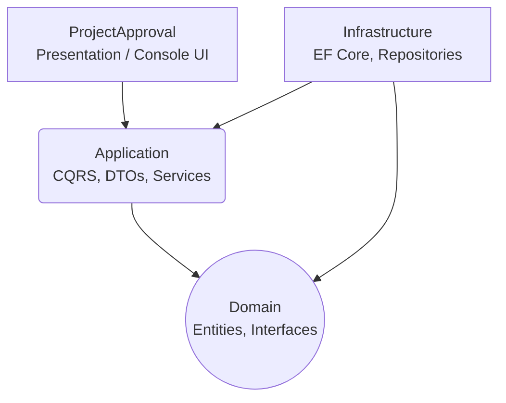

# 🚀 Sistema de Gestión y Aprobación de Proyectos


Un robusto sistema backend diseñado para gestionar, evaluar y realizar el seguimiento del ciclo de vida de propuestas de proyectos. Desarrollado en **C# (.NET 8)**, el proyecto implementa rigurosamente **Clean Architecture** y el patrón **CQRS**, garantizando un código altamente escalable, mantenible y testeable.

## 📸 Preview

> 💡 **Nota:** *[Espacio reservado para un GIF o demostración en video navegando por la interfaz de la aplicación]*

* **Screenshots:** *[Añadir capturas de la consola o la ejecución de los menús]*
* **Demo/Video:** *[Enlace a YouTube o GIF incrustado]*

## 📖 Descripción

Este proyecto nace con la necesidad de resolver la complejidad en los flujos de aprobación dentro de organizaciones o entornos académicos. Permite definir reglas de aprobación, asignar roles jerárquicos a los usuarios (evaluadores, administradores) y transicionar propuestas de proyectos a través de distintos estados de forma segura y auditada.

**¿Qué valor aporta?**
Centraliza la lógica de negocio compleja en un dominio puro, separando las responsabilidades de lectura y escritura. Esto hace que el sistema sea fácilmente adaptable a cualquier interfaz futura (Web API, Mobile, Desktop) sin modificar el núcleo de la aplicación.

## ✨ Características Principales

* **Gestión de Propuestas:** Creación, edición y seguimiento de `ProjectProposals`.
* **Motor de Aprobaciones:** Flujos configurables mediante `ApprovalRules` y `ProjectApprovalSteps`.
* **Gestión de Usuarios y Roles:** Administración de `Users`, `ApproverRoles` y `Areas`.
* **Trazabilidad:** Historial de estados (`ApprovalStatus`) para cada propuesta.
* **Entity Framework Core Fluent API:** Configuración para cada entidad para asegurar la persistencia.
* **Validación de Datos:** DTOs con reglas de validación integradas para garantizar la integridad de las solicitudes antes de procesar los casos de uso.
* **Data Seeding:** Población automática de datos iniciales para facilitar pruebas locales.

## 🛠️ Tecnologías Utilizadas

**Backend:**
* **Framework:** .NET 8.0 / C# 12
* **Patrones Arquitectónicos:** Clean Architecture, CQRS, Repository Pattern
* **Validaciones:** ASP.NET Core Data Annotations para validación de DTOs de entrada
  
**Base de Datos:**
* **ORM:** Entity Framework Core
* **Migraciones:** Code-First approach

**Dev Tools:**
* **Control de Versiones:** Git
* **IDE:** Visual Studio / JetBrains Rider

## 🏗️ Arquitectura del Proyecto

El proyecto sigue una estructura estricta de **Clean Architecture** dividida en 4 capas principales:



* **`Domain`**: Contiene las entidades del negocio (`ProjectProposal`, `User`, `ApprovalRule`, etc.) y las abstracciones de los repositorios. No tiene dependencias externas.
* **`Application`**: Implementa los casos de uso mediante **CQRS** (carpetas `Commands` y `Queries` separadas por entidad). Contiene DTOs y validadores.
* **`Infrastructure`**: Implementa la persistencia de datos. Contiene el `ProjectApprovalDbContext`, configuraciones de Fluent API y las implementaciones concretas de los repositorios.
* **`ProjectApproval`**: La capa de presentación. Una aplicación de consola interactiva con submenús, inputs validados y un `DataSeeder` para inicializar el sistema.

## 🚀 Instalación y Configuración

Sigue estos pasos para ejecutar el proyecto en tu entorno local:

1. **Clonar el repositorio:**
   ```bash
   git clone https://github.com/MaximilianoGimenez0/ProjectProposals_backend.git
   cd ProyectoSoftware_TP2_Correccion
   ```

2. **Restaurar dependencias:**
   ```bash
   dotnet restore
   ```

3. **Configurar la base de datos:**
   Asegúrate de que tu cadena de conexión esté configurada en `ProjectApproval/appsettings.json`. Luego, aplica las migraciones:
   ```bash
   dotnet ef database update --project Infrastructure --startup-project ProjectApproval
   ```

4. **Ejecutar el proyecto:**
   ```bash
   dotnet run --project ProjectApproval.Api
   ```

## 💻 Uso de la Aplicación

Al iniciar la aplicación, el `DataSeeder` poblará la base de datos con información inicial (roles, estados, reglas). Por lo tanto el servidor quedará levantado con los endpoints activos.

## 🧠 Decisiones Técnicas

* **CQRS (Command Query Responsibility Segregation):** Se decidió separar las operaciones de lectura (Queries) de las de escritura (Commands) en la capa de `Application`. Esto maximiza la claridad del código, facilita el testing unitario y prepara el sistema para escalar a nivel de rendimiento.
* **Repository Pattern:** Oculta la complejidad de Entity Framework Core detrás de interfaces definidas en el dominio. Esto permite cambiar el origen de datos o mockear la base de datos fácilmente en el futuro.
* **Data Seeding Controlado:** Se incluyó un mecanismo en el arranque para garantizar que entidades base (como `ApprovalStatuses` fijos) existan siempre, mejorando la experiencia de desarrollo (DX).

## 🚀 Mejoras Futuras

* **Autenticación y Autorización:** Implementar un sistema de autenticación basado en **JWT (JSON Web Tokens)** para gestionar la identidad de los usuarios y proteger endpoints mediante autorización basada en tokens, incorporando validación de credenciales, expiración de tokens y control de acceso a recursos protegidos.
* **Despliegue Cloud:** Dockerizar la aplicación y configurar un pipeline CI/CD para su despliegue en infraestructuras en la nube (ej. **AWS**), permitiendo una ejecución distribuida y de alta disponibilidad.
* **Cobertura de Pruebas:** Implementar tests unitarios para los Handlers de Application utilizando `xUnit` y `Moq`.

## 👨‍💻 Autor

**Maximiliano Giménez**  
*Fullstack / Cloud Developer*

[](https://www.linkedin.com/in/tu-perfil/)
[](https://github.com/tu-usuario)
[](https://tu-portfolio.com)
