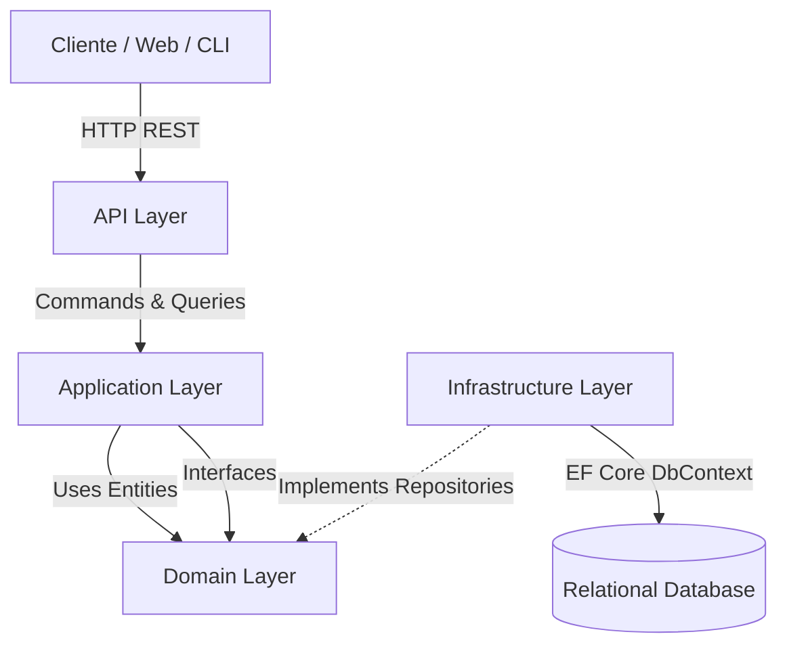

# 🚀 Project Proposals API

> Un motor backend avanzado para la gestión, evaluación y orquestación de flujos de aprobación de propuestas de proyectos institucionales.


---

# 📸 Preview

> 💡 **Espacio reservado para Demo:** Aquí puedes incluir un GIF o capturas mostrando las pruebas de los endpoints en Swagger UI o el flujo de una petición a través de un cliente REST como Postman/Insomnia.

---

# 📖 Descripción

**Project Proposals API** es una solución Backend robusta diseñada para resolver el problema de trazabilidad y burocracia en la aprobación de proyectos corporativos. 

Muchas organizaciones sufren de procesos de validación desordenados y difíciles de rastrear. Este sistema centraliza el ciclo de vida de una propuesta, definiendo dinámicamente quién debe aprobarla basándose en **reglas de negocio** (`ApprovalRules`), **roles de los aprobadores** (`ApproverRoles`) y el estado actual del flujo (`ProjectApprovalStep`). 

Este proyecto refleja un fuerte dominio en patrones de diseño empresariales, arquitectura de software orientada a la mantenibilidad y estándares de Clean Code.

---

# ✨ Características Principales

- **⚙️ Motor de Flujos de Aprobación:** Orquestación de pasos secuenciales y transiciones de estado a través de `ApprovalRules` y `ApprovalStatuses`.
- **📂 Gestión de Propuestas:** Flujo completo de creación, configuración y lectura de `ProjectProposals`.
- **👥 Sistema de Roles de Revisión:** Control y asignación de revisores mediante la entidad `ApproverRoles`.
- **🗂️ Taxonomía Dinámica:** Clasificación estructural de los proyectos a través de `Areas` y `ProjectTypes`.
- **🛠️ CLI Data Seeder Integrado:** Una aplicación de consola adjunta (`ConsoleInteractions` / `FirstSetupBuild`) diseñada para inicializar la base de datos de manera rápida en entornos de desarrollo local.

---

# 🛠️ Tecnologías Utilizadas

## Backend & Core
- **C# & .NET:** Lenguaje tipado de alto rendimiento para el desarrollo de la lógica central y la API REST.
- **ASP.NET Core Web API:** Exposición de endpoints HTTP mediante Controladores (`ProjectController`, `InformationController`).

## Database
- **Entity Framework Core:** ORM moderno utilizado para el mapeo objeto-relacional y la gestión del acceso a datos.
- **Fluent API:** Configuración estricta del esquema de base de datos a nivel de clases separadas (`Configurations`), sin contaminar el dominio.

## Architecture & Design Patterns
- **Clean Architecture:** Separación estricta de responsabilidades en 4 capas (Domain, Application, Infrastructure, Presentation/API).
- **CQRS Pattern:** Segregación profunda de operaciones separando Comandos (escritura) y Consultas (lectura) dentro de la capa `Application`.
- **Repository Pattern:** Abstracción completa de la persistencia mediante interfaces ubicadas en el dominio, asegurando bajo acoplamiento.

---

# 🏗️ Arquitectura del Proyecto

El sistema fue diseñado aplicando los principios de **Clean Architecture** fuertemente acoplados a **CQRS**, lo que garantiza que las reglas de negocio base sean completamente independientes de cualquier framework, interfaz o base de datos externa.



### Explicación de Capas:
- 🟣 **Domain:** El corazón del negocio. Contiene las entidades puras (`User`, `ProjectProposal`, `ProjectApprovalStep`, etc.) y las interfaces de los repositorios. Cero dependencias externas.
- 🔵 **Application:** Aloja la lógica de negocio estructurada en carpetas de **Commands** (`Add`, `Update`, `Delete`) y **Queries** (`GetAll`, `GetById`), además de DTOs y abstracciones de servicios.
- 🟢 **Infrastructure:** Capa de acceso externo. Implementa las interfaces del dominio, maneja la persistencia con `ProjectApprovalDbContext` e inyecta la lógica de las base de datos.
- 🟡 **Presentation:** Puntos de entrada del usuario o cliente, en este caso representados por la Web API (`ProjectApproval.Api`) y la herramienta de Consola (`ProjectApproval`).

---

# 📂 Estructura del Proyecto

```text
ProjectProposals_backend-main/
├── 📁 Application/                # Capa de aplicación (CQRS)
│   ├── 📁 <Entity>/Commands/      # Lógica de Mutación (Add, Delete, Update)
│   ├── 📁 <Entity>/Queries/       # Lógica de Lectura (GetAll, GetById)
│   ├── 📁 Dtos/                   # Data Transfer Objects
│   ├── 📁 Exceptions/             # Control y mapeo de excepciones
│   └── 📁 Interfaces/             # Contratos principales
├── 📁 Domain/                     # Capa central (Enterprise Business Rules)
│   ├── 📁 Entities/               # Modelos ricos del dominio
│   └── 📁 Interfaces/             # Contratos para repositorios
├── 📁 Infrastructure/             # Capa de Infraestructura
│   ├── 📁 Migrations/             # Historial de versiones EF Core
│   └── 📁 Persistence/            # DbContext, Repositorios y configuraciones
├── 📁 ProjectApproval.Api/        # Capa de Presentación REST
│   └── 📁 Controllers/            # Endpoints expuestos al exterior
└── 📁 ProjectApproval/            # CLI y utilidades
    ├── 📁 ConsoleInteractions/    # Menús e inputs
    └── 📁 FirstSetupBuild/        # Data Seeder (DataSeeder.cs)
```

---

# 🚀 Instalación y Configuración

Para poner en marcha la solución en un entorno de desarrollo, sigue los siguientes pasos:

1. **Clonar el repositorio:**
   ```bash
   git clone https://github.com/tu-usuario/ProjectProposals_backend.git
   cd ProjectProposals_backend-main
   ```

2. **Restaurar las dependencias de NuGet:**
   ```bash
   dotnet restore ProjectApproval.sln
   ```

3. **Configurar la base de datos:**
   Revisa tu cadena de conexión (ConnectionString) en el archivo `appsettings.json` ubicado dentro del proyecto `ProjectApproval.Api`.

4. **Aplicar las migraciones (Crear la DB):**
   ```bash
   dotnet ef database update --project Infrastructure --startup-project ProjectApproval.Api
   ```

5. **Ejecutar la API:**
   ```bash
   dotnet run --project ProjectApproval.Api
   ```

> 💡 **Tip:** Alternativamente, puedes ejecutar el proyecto principal de Consola (`ProjectApproval`) para lanzar los flujos integrados de primera configuración y seeding.

---

# 🧠 Decisiones Técnicas y Valor Aportado

1. **Segregación de Responsabilidades con CQRS:**
   En lugar de usar grandes servicios con lógicas superpuestas, la capa de Aplicación está atomizada en `Commands` y `Queries` específicos por entidad. Esto prepara la aplicación para ser altamente escalable (pudiendo tener lecturas y escrituras manejadas con diferentes optimizaciones).
   
2. **Uso de Fluent API por encima de Data Annotations:**
   La configuración de las restricciones de la base de datos (longitud de strings, claves primarias/foráneas) se ha movido por completo a la carpeta `Configurations` dentro de la Infraestructura. Esto mantiene las Entidades del Dominio impecables, sin ensuciarse con atributos ligados a Entity Framework.

3. **Inyección de Dependencias y Principios SOLID:**
   El flujo de control depende 100% de abstracciones (interfaces de repositorios y manejadores). Esto facilita la capacidad de mockear servicios para realizar testeos eficientes en el futuro.

---

# 🚀 Mejoras Futuras

- [ ] Incorporar `MediatR` explícito (o un middleware de Dispatcher) para optimizar el ruteo de comandos y consultas.
- [ ] Integrar validación robusta a través de `FluentValidation` como Pipeline Behaviors antes de que el comando alcance el Handler.
- [ ] Implementar un sistema de Autenticación y Autorización JWT.
- [ ] Desarrollo de Suite de Testing Automático (Unitario y de Integración) usando `xUnit` y `Moq`.

---

# 👨‍💻 Autor

**[Tu Nombre]**  
*Software Engineer | Backend Developer*

[](https://linkedin.com/in/tu-perfil)
[](https://github.com/tu-usuario)
[](https://tu-portfolio.com)
